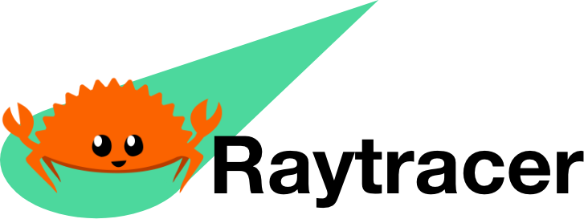
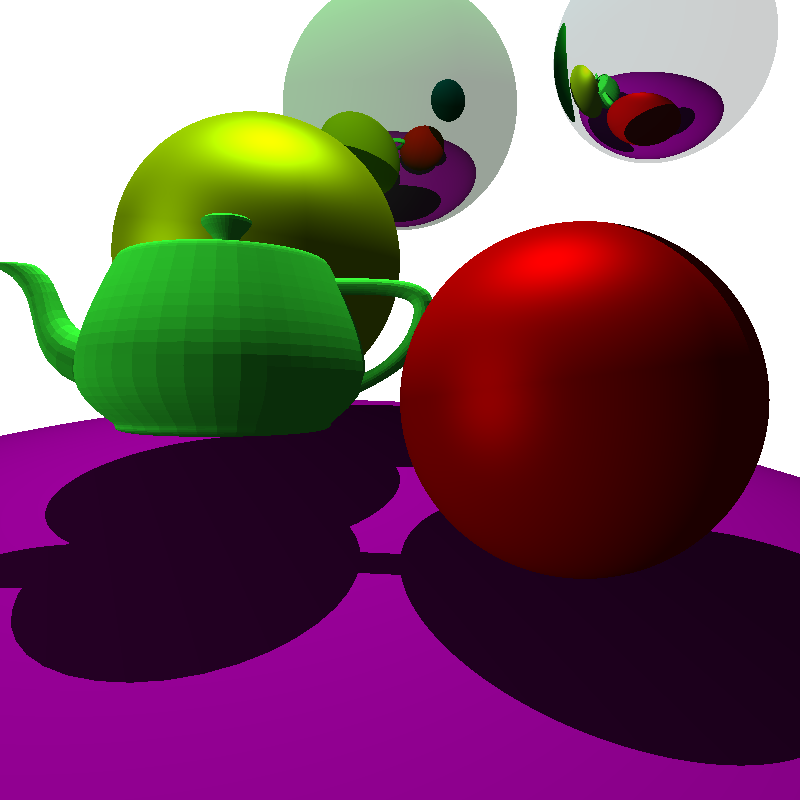

---


This repo is just an experimental project that I have been doing, in order to learn Rust.

## Screenshots

- 5 samples per pixel
- 6320 triangles



## How to use

In `main.rs` instantiate camera and a scene (in this order) and add to-be rendered objects to `scene.objects` array. Then run `cargo run --release`.

**NOTE**: As teapot model has thousands of triangles to render, the process might take a lot of time. You can simply remove this 3D model by commenting out the lines where it is added to scene.

```rust
//scene.objects.push(Box::new(obj));
```

**TODO**: The wasm integration will make usage easier.

## Features

The following program has support of:

- Diffuse and specular materials
- Lights (3 types)
- Reflections
- Shadows
- Camera and viewport control (FOV, orientation)
- Antialising (by multisampling)
- Simple .obj file reading
- AABB optimization
- Multithreading
- Builder pattern for constructing objects

### To do

- [ ] Integration with WebAssembly
  - [ ] Interaction with objects
- [ ] Gamma correction
- [ ] Refraction
- [ ] Textures

## Related

It was in turn inspired by several projects listed below:

- [Computer Graphics from scratch (JS)](https://www.gabrielgambetta.com/computer-graphics-from-scratch/introduction.html)
- [Understandable RayTracing in 256 lines of bare C++](https://github.com/ssloy/tinyraytracer/wiki)
- [Ray Tracing in One Weekend (C++)](https://raytracing.github.io/books/RayTracingInOneWeekend.html)
- [Writing raytracer in Rust series](https://bheisler.github.io/post/writing-raytracer-in-rust-part-1/)

